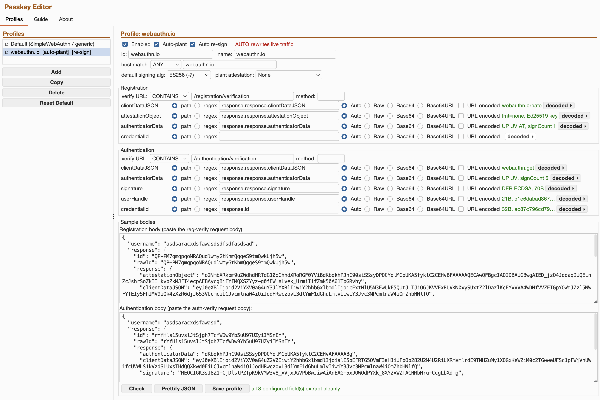
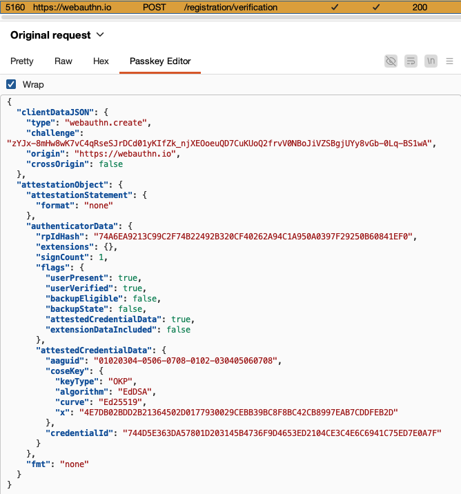
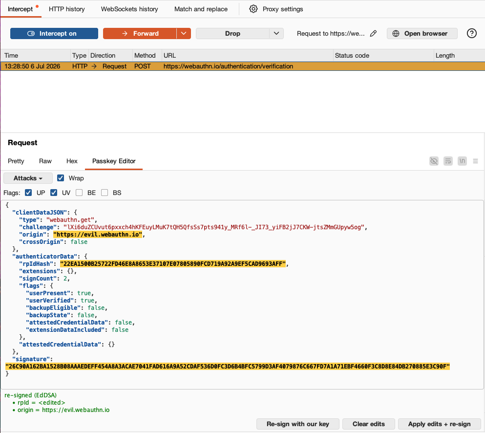
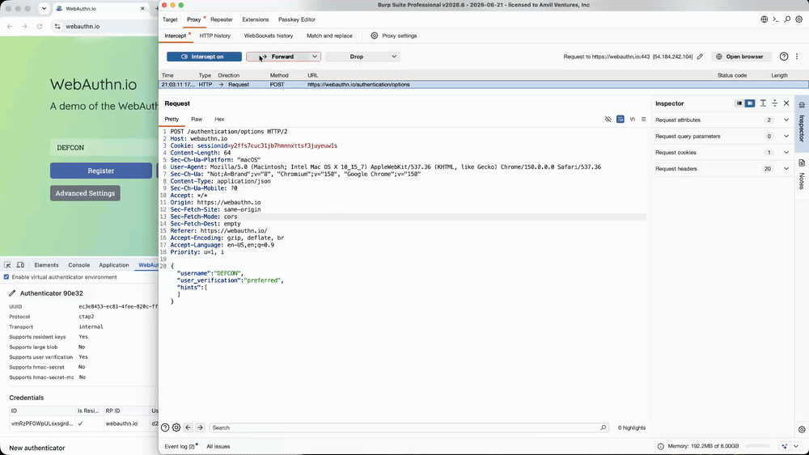
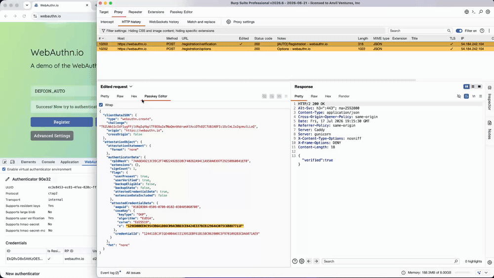
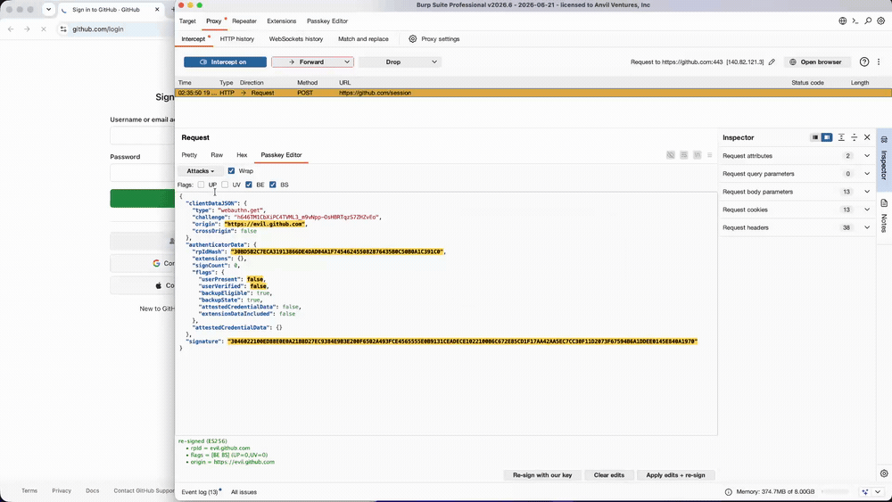

# Passkey Editor

A Burp Suite extension for testing WebAuthn and FIDO2 passkey ceremonies.

It detects registration and authentication ceremonies in HTTP traffic, decodes their
wrapped CBOR/COSE payloads into an editable, human-readable view, and offers one-click
attacks plus optional in-flight automation. The mechanical parts of passkey testing run
in the background so you can focus on logic flaws.

Built on the Burp [Montoya API](https://portswigger.github.io/burp-extensions-montoya-api/).

## Features

- **Ceremony detection.** Regex-based detection of `webauthn.create` and `webauthn.get`.
- **Wrapper decoding.** Transparently unwraps what relying parties put on the wire: single
  and double Base64 (standard and URL-safe, padded or not) and JSON envelopes, per field
  and losslessly. Re-encoding reproduces the original bytes.
- **CBOR/COSE decode and edit.** The attestation object, authenticator data and COSE keys
  are decoded to JSON, down to byte-level edits of `authData` (flag bits, signature
  counter, RP-ID hash). Authenticator extensions are not decoded.
- **Change highlighting.** Every edited field is highlighted in amber, so you can see at a
  glance what changed from the captured ceremony.
- **One-click attacks.** Signature invalidation, UV bypass, origin and RP-ID mutation,
  cross-origin (clickjacking) forge, assertion forgery, registration key substitution and
  credentialId swap.
- **Multi-algorithm re-signing.** 11 COSE algorithms supported. Pure JDK crypto, no external providers.
- **Per-target profiles.** Per-host, per-phase field locations and a default signing
  algorithm, so extraction adapts to each relying party from configuration, not code.
- **AUTO mode.** Re-signs or plants credentials in-flight for an armed target.

## Interface

Passkey Editor lives in two places: a suite-level tab for configuration, and an editor tab
that attaches to any request or response carrying a ceremony.

### The Passkey Editor tab

The suite tab holds everything not tied to a single request: the profile registry, a guide,
and an about panel. A profile tells the tool where a relying party puts `clientDataJSON`,
`attestationObject`, `authenticatorData`, `signature` and `credentialId`, how each field is
encoded, and which algorithm to sign with by default. You can validate a profile against a
captured body with **Check**.



### The ceremony editor

On any request or response with a detected ceremony, a **Passkey Editor** tab appears next
to Pretty, Raw and Hex. It renders the decoded ceremony as JSON, editable on an authentication
and read-only on a registration. Edit a field and the extension re-encodes, re-signs when
needed, and re-wraps to the exact wire format on send. The output is byte-identical when
unedited.

Editing is supported in **Proxy intercept** and **Repeater**. The tab also renders in Proxy
history, read-only, so a captured ceremony stays readable with its changed fields still
highlighted.



## Attacks

The presets below are one click away, from the **Attacks ▾** menu, the action buttons, or the
flag checkboxes. Anything that changes signed bytes is re-signed automatically with a key the
tool controls.

| Attack | Ceremony | What it does |
| --- | --- | --- |
| Signature invalidation | Authentication | Degrades the assertion signature four ways, to find a relying party that does not verify it. **Flip trailing byte** keeps the length and structure intact, so the relying party parses the signature and reports a clean verification failure. **Empty** asks whether a signature is required at all. **Zeroed** and **random bytes** keep the original length.<br><br>*Note: against ES256/384/512 those last three are not valid DER, so a parse-then-verify relying party throws on decode instead of reporting a bad signature, which is a different signal and worth telling apart. EdDSA and RSA signatures are raw blobs with no framing to break, so there all four modes just fail verification.* |
| UV bypass | Both | Two routes to the same end. In the **ceremony**, clear the user-verification (UV) flag in `authData` and re-sign. In the **options response**, downgrade the relying party's `userVerification` policy to `discouraged`, so the authenticator legitimately returns `UV=0` and the assertion that follows is genuine rather than forged. The second finds a relying party that enforces a policy it sent but never re-checks on the way back. |
| Origin / RP-ID mutation | Authentication | Rewrites `origin` or the RP-ID hash and re-signs, to probe weak origin or RP-ID validation. |
| Cross-origin forge | Authentication | Sets `crossOrigin=true` and an attacker `topOrigin` while leaving `origin` intact, then re-signs, to find relying parties that skip the framing check (CWE-1021). |
| Flag toggles | Both | Flip any combination of authenticator-data flags (UP, UV, BE, BS). On an assertion the result is re-signed. On a registration the attestation object is re-encoded instead, and with no key planted it emits `fmt=none`, dropping the original attestation statement. The status line reports which format it emitted. |
| Assertion forgery | Authentication | Re-signs the assertion with a key the tool controls. Succeeds once the relying party has stored a substituted key. |
| Registration key substitution | Registration | Swaps the embedded credential public key for one the tool holds (as `fmt=none` or a packed self-attestation), so the relying party stores the attacker's key. This opens the door to forged assertions and account takeover. |
| credentialId swap | Registration | Replaces the `credentialId` to probe collision and overwrite handling. |

The presets are shortcuts, not limits. On an authentication you can hand-edit the decoded JSON
(`clientDataJSON` in full, plus the `authenticatorData` flags, signature counter and RP-ID hash),
then **Apply edits + re-sign** re-encodes, re-signs and re-wraps it to the wire format on send.
A registration is a read-only decode, edited through the plant, attestation, flag and
credentialId controls instead. More presets are on the way.



## Supported algorithms

Re-signing covers 11 COSE algorithms, a superset of what common WebAuthn stacks negotiate.
All use pure JDK crypto (SunEC, SunRsaSign, Ed25519), with no BouncyCastle or other external
provider.

| Algorithm | COSE ID | Family |
| --- | --- | --- |
| ES256 | -7 | ECDSA, P-256 |
| ES384 | -35 | ECDSA, P-384 |
| ES512 | -36 | ECDSA, P-521 |
| EdDSA | -8 | Ed25519 |
| RS256 | -257 | RSASSA-PKCS1-v1_5 |
| RS384 | -258 | RSASSA-PKCS1-v1_5 |
| RS512 | -259 | RSASSA-PKCS1-v1_5 |
| RS1 | -65535 | RSASSA-PKCS1-v1_5 (SHA-1) |
| PS256 | -37 | RSASSA-PSS |
| PS384 | -38 | RSASSA-PSS |
| PS512 | -39 | RSASSA-PSS |

## Usage

Two flows: forging a credential on a permissive relying party, then turning the same tooling
against a hardened one.

### Forge a credential and log in

On a relying party that does not catch the substitution, plant a key you control at
registration (as `fmt=none` or a packed self-attestation), then re-sign the authentication
assertion with it, ignoring the one created by the real Authenticator.



*Full clip: [forge-manual.mp4](assets/videos/forge-manual.mp4)*

AUTO mode does the same without touching the editor: arm a profile, run the browser flow, and
the extension re-signs and plants in-flight. Orange marks every ceremony row on a tracked host,
whether or not AUTO acted. The rows it rewrote carry an `[AUTO]` comment, a line in
**Extensions > Output**, and Burp's **Edited** flag. It stays off until you arm a target, and a
manual edit always wins.



*Full clip: [forge-auto.mp4](assets/videos/forge-auto.mp4)*

### Attacks against a hardened relying party

Against a correctly implemented relying party the editor still tampers freely, but the
ceremony is rejected. Below, `origin` and the RP-ID are mutated and the assertion is
re-signed with our key; the relying party declines the sign-in.



*Full clips: [framing-1.mp4](assets/videos/framing-1.mp4), [framing-2.mp4](assets/videos/framing-2.mp4), [framing-3.mp4](assets/videos/framing-3.mp4)*

## Getting started

**Requirements**

- Burp Suite 2026.4 or newer. Professional recommended: profiles persist in the project file,
  which Community's temporary projects cannot save.
- JDK 21, only if you build from source.

**Install**

Download `passkey-editor.jar` from the [latest release](../../releases/latest), or build it
yourself (below). In Burp, go to **Extensions > Installed > Add** and select the jar.

A **Passkey Editor** suite tab appears, and the editor tab is offered on any request or
response containing a detected ceremony.

**Build from source**

Set `JAVA_HOME` to a JDK 21, then build with the bundled Gradle wrapper:

```bash
# Point JAVA_HOME at a JDK 21, for example:
#   macOS (Homebrew):     export JAVA_HOME="$(brew --prefix openjdk@21)/libexec/openjdk.jdk/Contents/Home"
#   Linux:                export JAVA_HOME=/usr/lib/jvm/java-21-openjdk
#   Windows (PowerShell): $env:JAVA_HOME = "C:\Program Files\Java\jdk-21"

./gradlew jar     # -> build/libs/passkey-editor.jar
```

On Windows, use `gradlew.bat` in place of `./gradlew`.

## Responsible use

Passkey Editor forges credentials and rewrites live authentication traffic. Use it only against
systems you own or have explicit permission to test. How you use it is your responsibility.

Three things to know before you arm a profile:

- **Arming is the only opt-in.** AUTO mode ignores Burp's target scope, so an armed profile
  rewrites every matching ceremony whether or not the host is in scope. It acts in Proxy and
  Repeater only. Scanner, Intruder and the recorded-login replayer are excluded, since each
  re-issue would plant another key on the account.
- **A host rule can match more than one site.** An armed profile rewrites traffic on every host
  its host match covers, so give it a specific host. The Default matches every host, which is
  why it can never be armed.
- **Planted keys are held in memory for the current session.** Unloading the extension or
  restarting Burp destroys them, and the credential you planted then works for nobody, you or
  the real authenticator. Plant only where you can re-register.

## Contributing

Contributions are welcome. See [CONTRIBUTING.md](CONTRIBUTING.md) for how to propose ideas,
report bugs, improve the docs, or send code, and please note our
[code of conduct](CODE_OF_CONDUCT.md).

## License

Released under the [MIT License](LICENSE).

Third-party components bundled in the extension jar are listed in
[THIRD-PARTY-NOTICES.md](THIRD-PARTY-NOTICES.md).
